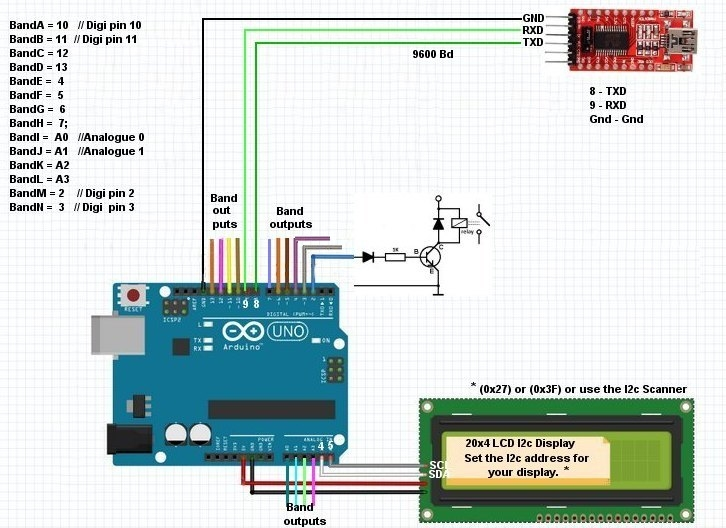

# SDRuno SMART SWITCH

## David Whitty G4FEV

This software is given freely for non-commercial use with no guarantee given or implied.
SDRUno is a product of SDRPlay Ltd with which the author has no connection other than as a satisfied customer.

## What is this?

An Arduino is used to detect the frequency SDRuno is tuned to.
The frequency is decoded and activates up to 14 outputs to automatically select antennas, filters or amplifiers as required for your particular application.

## How does it work?

SDRuno uses commands from the Kenwood CAT command set.
The Arduino sends the    IF;    Status request to an SDRuno VRX. 
SDRuno responds with;-

     IF0145500000   +00000000002100000; 
           |                   | |
        145.500 MHz           |  | VFO
                              |	
                             Mode  

The Arduino has 14 unused pins (If we include unused Analogue pins) which may all be used for switching relays to swap antennas, filters or amplifiers.

## Does it compile?

Beware! There are several versions of  SoftwareSerial and Liquidcrystal I2c libraries which may not be compatible without minor changes to the declarations.
Built & tested using Arduino IDE Version 1.8.13
SoftwareSerial from Arduino IDE Version 1.8.13
LiquidCrystal     I2C-1.1.2     by Frank de Brabander
SDRUno Version 1.33 and 1.40.1
SDRplay RSP1A (Because that’s all I have).

We use the SoftwareSerial library for the coms to SDRuno. 
Pin 8 is Rxd and 9 Txd which leaves the normal Arduino coms port for debugging information via the IDE Serial Monitor.

## Hardware Requirements.

FTDI USB to SERIAL converter
The Arduino requires TTL levels (5v) but a computer uses RS232 levels. Never connect a computer directly to an Arduino or damage may occur.
RS232 to TTL converters are easily and cheaply available online.            

RELAYS

The maximum current an Arduino pin can switch is 40mA so we use a transistor to switch coax relays or slave relays.

Ready mounted Arduino relays are available on auction sites but CAUTION. Many of these are Active LOW. 
The code is designed for ACTIVE HIGH.
You could swap all the Hi and lows but it would mean most of your relays would be operated all the time.
If you want to use Ready-Made Relay Boards look for the type with a jumper that can be set ACTIVE HI.

 

## SOFTWARE

Set the correct I2c address for your LCD I2c or you will just see a blank screen. (0x27) for older displays (0x3F) for newer displays or use the Arduino I2c scanner to discover the address.

Setting the Band Limits

Modify this part of the code to suit your application, located near the top of the sketch.
You may edit the frequencies and the Antenna / Filter name.
Shown below are the first three, of 14, Bands

/////////////////////////////////////////////////////////////////////////////////////////

//Band A
char AntennaA[ ] = " VLF Antenna ";  //Fill all 13 characters
long BandALow = 1000;              //1KHz  Band A     Low Limit
long BandAHi = 150000;            //150KHz  Band A     High Limit

//Band B
char AntennaB[ ] = " Medium Wave ";  //Fill all 13 characters
long BandBLow = 150001;           // Band B   Low Limit
long BandBHi = 1600000;          //1.6MHz Band B     High Limit

//Band C
char AntennaC[ ] = " LF Antenna  ";  //Fill all 13 characters
long BandCLow = 1600001;           // Band C   Low Limit
long BandCHi = 2500000;           //2.5 MHz Band C   High Limit

//////////////////////////////////////////////////////////////////////////////////////////////

Notice how the next band up starts one Hertz above the last band.
The bands don’t have to run contiguously. This is just an example.

SUGGESTION.

Run the code as unmodified using LEDs on the Band Outputs and see how they react to frequency changes before you modify for your own requirements. 

You don’t have to use all the outputs just park them out of the way near the 2GHz (or 1KHz) end of the spectrum so they never operate or comment them out.

Just because there are 14 outputs (Bands A–N) the user can split the spectrum into as few chunks as required.
Take care as you move higher up in the spectrum. There are a lot of zeroooos to trip over. It’s easy to get in a right old mess. (I speak from experience!)

There is no reason why you shouldn’t have TWO or more outputs active for a particular frequency if that suits your needs (To switch in a filter or preamp).

Which Pin is which band.

The Pin definitions for each band are just below the Band Limits section in the code.
Unless you want to modify the code there is nothing else that requires editing
Serial.print debug messages have been commented-out, apart from the current Frequency.
Uncommenting the remaining Serial.print messages will allow the user to monitor the decoding process the results of which may be viewed on the serial monitor as the program runs.
<i>See also Helpful-Notes section.</i>

## SETTING UP SDRUno

Plug in your USB to FTDI TTL  converter and note its Com port.
For Windows you will find this in Devices and Printers.

Top Left corner of theSDRUno  “RX Control window” click the Sett button.
Navigate along to the CAT option.
Select the com port and set the Baud Rate to 9600
Select Enable & Connect.
That’s it. 
If all is well the display should change from “Waiting for data”
See also Helpful-Notes section.

Picture

## Helpful-Notes.

Multi VRX setups. 
You can use as many Smart-Switches as you like and allocate a smart -switch to each VRX. Just set the com port for each individual Smart -Switch to the VRX as above.

Scanning
It may be unwise to switch antennas while scanning. Ensure your scanning frequencies are all on one band for optimum performance.
It will work however the switching time may cause signals to be lost during the changeover period

If you really want it to switch superfast uncomment ALL of the Serial.print  lines to the Serial Monitor and experiment with increasing  the baud rates  Comms speed test up to 57600

Can I some more Sir.
With some minor code changes switch to an Arduino Mega which will provide 54 outputs which should be enough for anyone.

Error message on starting SDRUno
If you start SDRUno before connecting the FTDI  USB converter it will throw up this error. 
You must go into the VRX SETT and toggle the CAT setting ENABLE & CONNECT

LCD Blank Screen.
Have you set the correct I2c address for your LCD. These are normally  0x3F or 0xFF or even 0x27 if you have an older display.
Use the Arduino I2c scanner sketch to confirm your address and the Hello World example to check it works

