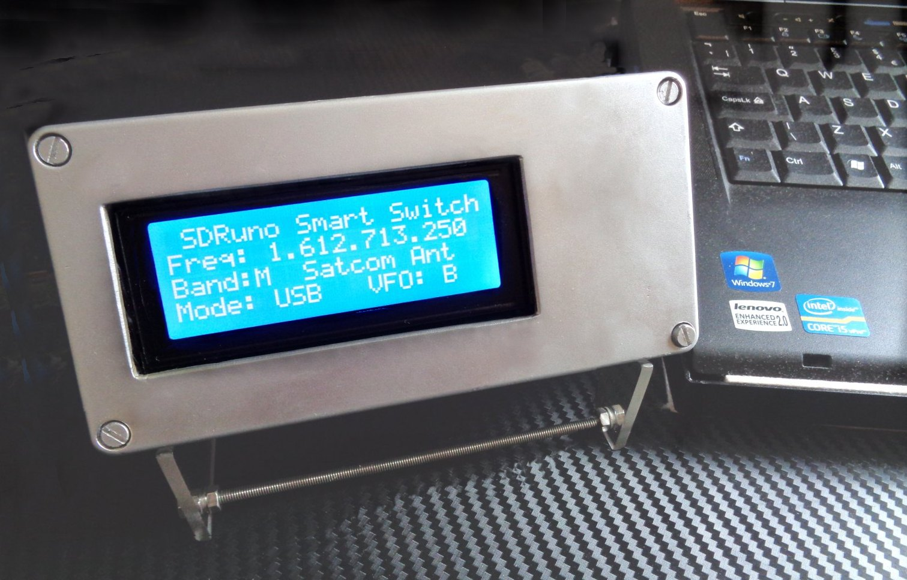
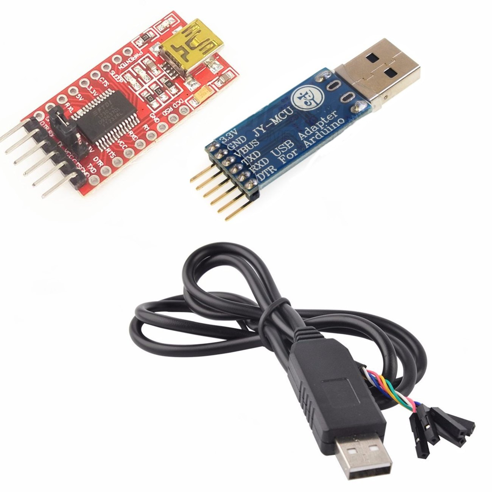
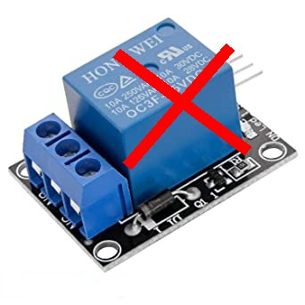
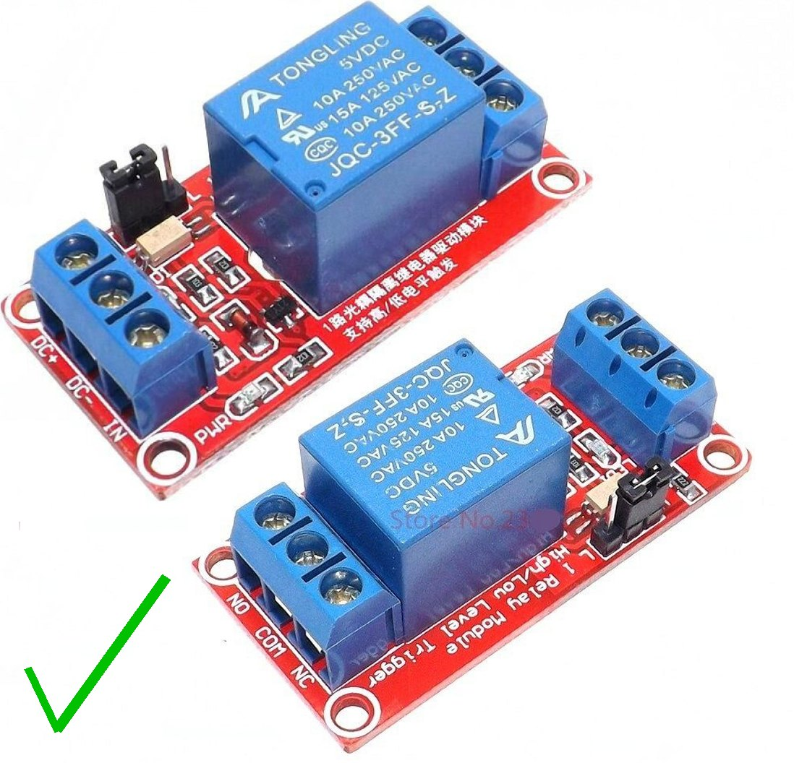

# SDRuno SMART SWITCH

## David Whitty G4FEV

This software is given freely for non-commercial use with no guarantee given or implied.
SDRUno is a product of SDRPlay Ltd with which the author has no connection other than as a satisfied customer.

## What is this?

An Arduino is used to detect the frequency SDRuno is tuned to.
The frequency is decoded and activates up to 14 outputs to automatically select antennas, filters or amplifiers as required for your particular application.

## How does it work?

SDRuno uses commands from the Kenwood CAT command set.
The Arduino sends the    IF;    Status request to an SDRuno VRX. 
SDRuno responds with;-

     IF0145500000   +00000000002100000; 
           |                   | |
        145.500 MHz           |  | VFO
                              |	
                             Mode  

The Arduino has 14 unused pins (If we include unused Analogue pins) which may all be used for switching relays to swap antennas, filters or amplifiers.

## Does it compile?

Beware! There are several versions of  SoftwareSerial and Liquidcrystal I2c libraries which may not be compatible without minor changes to the declarations.
Built & tested using Arduino IDE Version 1.8.13
SoftwareSerial from Arduino IDE Version 1.8.13
LiquidCrystal     I2C-1.1.2     by Frank de Brabander
SDRUno Version 1.33 and 1.40.1
SDRplay RSP1A (Because that’s all I have).

We use the SoftwareSerial library for the coms to SDRuno. 
Pin 8 is Rxd and 9 Txd which leaves the normal Arduino coms port for debugging information via the IDE Serial Monitor.

## Hardware Requirements.

FTDI USB to SERIAL converter
The Arduino requires TTL levels (5v) but a computer uses RS232 levels. Never connect a computer directly to an Arduino or damage may occur.
RS232 to TTL converters are easily and cheaply available online.            

RELAYS
The maximum current an Arduino pin can switch is 40mA so we use a transistor to switch coax relays or slave relays.

Ready mounted Arduino relays are available on auction sites but CAUTION. Many of these are Active LOW. 
The code is designed for ACTIVE HIGH.
You could swap all the Hi and lows but it would mean most of your relays would be operated all the time.

 &nbsp; &nbsp; &nbsp; &nbsp;  &nbsp; &nbsp; &nbsp; &nbsp; 

WORK IN PROGRESS.

